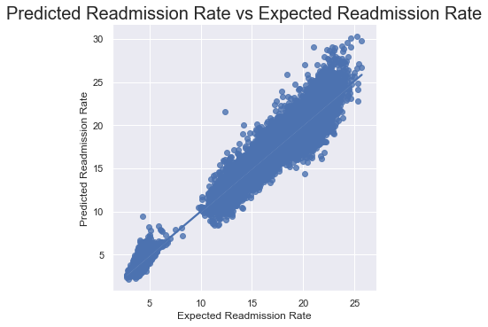
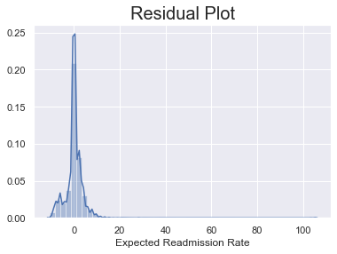
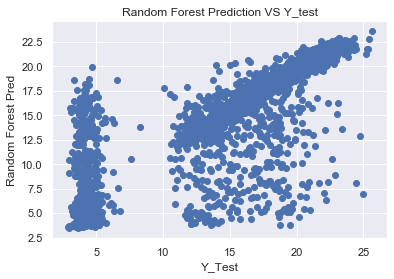

## Overview

Hospital Readmission is a big issue within the industry. As someone who wants to become a Data Scientist in Health, I wanted to contribute to its cause. The data obtained was from medicare.gov and it features 19,344 data. The objective of this project is to predict how readmission rate are and see if we can decrease it.

# Exploratory Data Analysis

# Random Forest plot:

# Model Building
* Linear Regression: Baseline
* Random Foresst: improve our model

# Performance
Linear Regression:
* MAE: 2.194861321375502
* MSE: 13.576794192454898
* RMSE: 3.684670160605274

Random Forest:
* MAE: 1.012662791258991
* MSE: 6.609562800725658
* RMSE: 2.570906999625941
