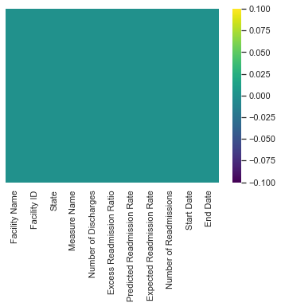

## Summary

## Introduction

I am going to do a data science project to predict the progression with machine learning. Data Science is a challenging field for everybody, but it is very rewarding. The reason I say this is because technology is improving and there is a need for data scientists out there. Also, many data scientists often choose a specialization after learning about the industry that interests them (in my case, it would be health).

## Data Collection and Cleaning:

The objective of this project is to predict how well the 'Expected Readmission Rates' model will perform based on its features. The data has a prediction feature and we will compare that data with our result. The majority of the time in data collection, you would need to scrape data from websites and compile it into a CSV (comma-separated value) file. However, some websites have data for you such as Kaggle.com and UCI Machine Learning Repository. In my case, my data was obtained from Data.Medicare.gov. After importing the data, I am going to read my data.

The first thing I would check is to see if there are any missing values in this data set. To check for missing values, I would use the 'IsNull()' function that is built into python. However, I believe the best way to see missing values is to create a heatmap (Figure1: Missing Data) as it shows a better representation of how much data is missing.

 

I have two options: remove the feature completely or replace the feature with its mean. Generally in Data Science, if the feature has a lot of missing values (ex. Footnote), it is best to remove it from the dataset. However, for some of our other features that do not contain a lot of missing values, it is better to replace it with its average because the features are very important for this project. Cleaning the dataset was confusing at first since I tried to replace the values with its mean but there would be a feature that had its missing values. After looking at it, I realized that the column had a different type compared to its neighbors so I had to change the type. This resulted in fixing that issue as shown.

# Data Visualization

After I finish cleaning the Data, I begin working on some visualization to see how the data are relative to its dependent feature. In my case, I want to see how a graph between 'Expected Readmission Rate' and 'Predicted Readmission Rate'. The reason for this is because it gives us an estimation of how accurate the predicted rates are.

Figure 4 is a graph comparing the number of discharges with Expected Readmission Rate. There seems to be a cluster amount of discharges (ranging from 0 – 4000), which indicated that hospitals have an average amount of discharges. Expected Readmission Rate in figure 4 has a peak when Readmission Rate is fairly low, but the chart slowly decreases as the amount of discharges increases. Figure 5 is similar to figure 4, but there seems to be a bigger cluster compared to figure 4.
Figure 4: Expected Readmission Rate VS Predicted Readmission RateFigure 4: Number of Discharges VS Expected Readmission RateFigure 5: Number of Readmissions VS Expected Readmission RateMachine Learning Algorithm

After Visualization the data, it is time for the best part: Machine Learning Algorithm. I am predicting readmission rates, I would use a Linear Regression Algorithm and see how accurate the model is doing. Before I can get into Linear Regression, I need to scale to the data. Why is this important? Scaling the data will help normalize the dataset and that will make our prediction more accurate. If some features values are greater than other features, it would be problematic. After scaling the feature by using the 'fit_transform' function, I can now train/test my dataset. I performed an 80/20 ratio on my data and begin using Linear Regression Algorithm. After applying it, I received a precision score of around 49.26%, which is not a terrific score. Why is it the case? One of the greatest factors can be the lack of information provided in my features. Another reason can be my train/test ratio or perhaps a Linear Regression Model is not the best option for this dataset. Figure 6 shows a difference between our test values and prediction values. If the values are fairly accurate, it would create a normal distribution curve. However, you can see that it does not give us that.

Figure 6: Linear Regression ResidualsLet's try the model with another machine learning algorithm. This time, I am going to use a Random Forest. Why did I choose Random Forest out of all Regression models? Random Forest is a machine algorithm that runs the prediction many times and chooses the best result for it. This guarantees that the accuracy of this prediction will be high compared to Linear Regression. After importing Random Forest and comparing its accuracy, I received a precision score of 91.5%, which is amazing! By looking at figure 7, we can see that the left and right sides are both symmetrical, with a fairly high peak at the mean of 0.

Figure 7: Random Forest ResidualsWhy is this important? Our objective is to predict the accuracy Expected Readmission Rate will occur and compare it with the given prediction Readmission Rate. Linear Regression has a precision score of around 49.26% which is less than what Random Forest produced. However, the predicted values from the data have a precision score of around 96%, beating our model. Why is this the case? One of the biggest factors can be feature selection. When Medicare.gov made the dataset public, their prediction could've had more features than it was given. By not having enough features, our model accuracy will not be as accurate. Another reason can be the train/test ratio they used. Overall, even though our data did not beat the data provided, it did really well with the features provided.ontents

